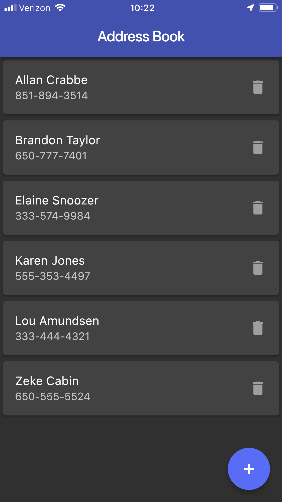
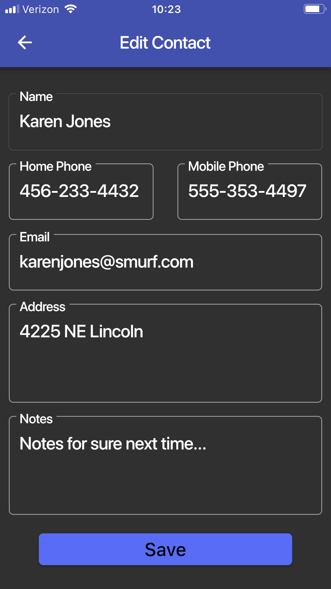

# address_book

The app is a standard Master / Detail application. The Master page is a listview that displays the contacts. The Detail page is a Form that allows creating or editing a contact, with validation. The TextFormFields use a number of the different options available for them. AddressBook is a Flutter sample app. It uses MySQL1 to store the data, so a MySQL database is required. And the first thing to do is to edit database_helper.dart and enter the settings for your database.
30 Oct 2021: Updated to Flutter 2.5.3, Dart 2.14.4 with Null Safety, etc.

|
|

## License

address_book is licensed under the Unlicense. See the LICENSE file for more information, but basically this is sample code and you can do whatever you want with it.